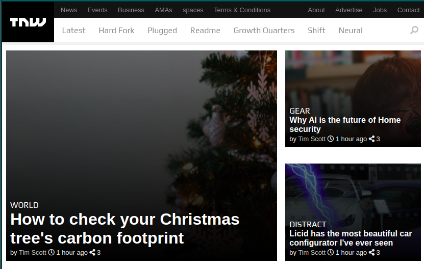
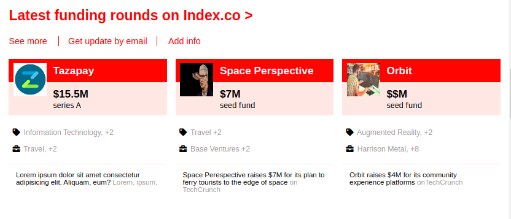
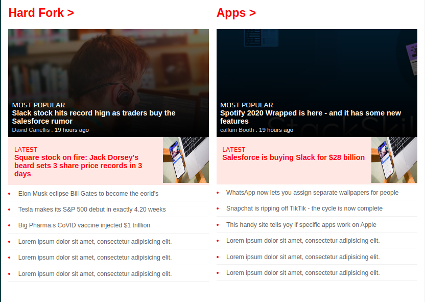
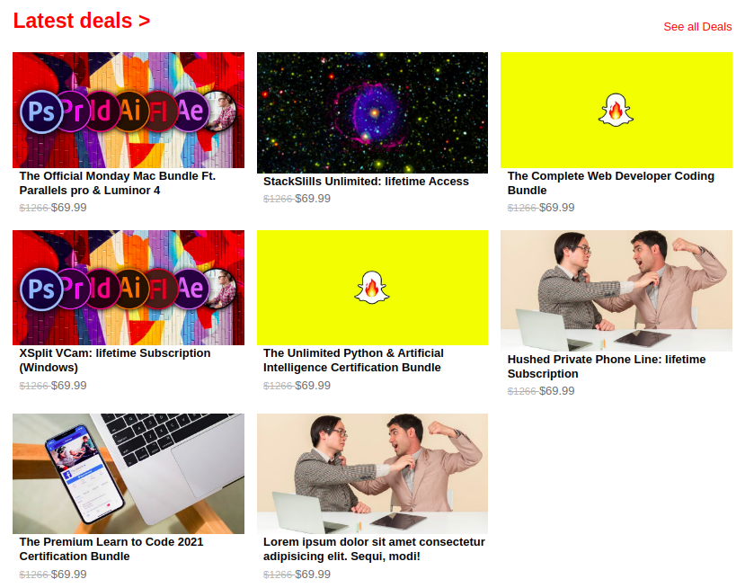
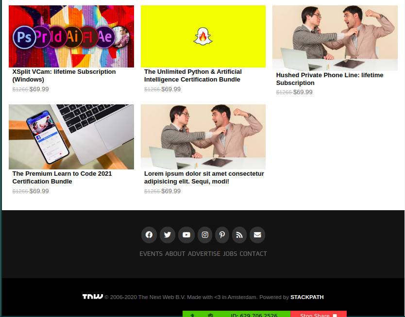

# TheNextWeb-clone

> We have created the clone of the famous Tech magazine The Next Web. This project has been created as a part of Microverse Collaborative Project.

## Built With

- HTML and CSS

## Live Demo

[Live Demo Link]()

## Getting Started

**This is an example of how you may give instructions on setting up your project locally.**
**Modify this file to match your project, remove sections that don't apply. For example: delete the testing section if the currect project doesn't require testing.**

To get a local copy up and running follow these simple example steps.

### Prerequisites

### Setup

### Install

### Usage

### Run tests

### Deployment

## Authors

👤 **Amit Kumar**

- GitHub: [@githubhandle](https://github.com/KumarAmitt)
- Twitter: [@twitterhandle](https://twitter.com/ArrshAmitt)
- LinkedIn: [LinkedIn](www.linkedin.com/in/kumar-amitt)

👤 **Frederick mih**

- GitHub: [@githubhandle](https://github.com/FrederickMih)
- Twitter: [@twitterhandle](https://twitter.com/MihFrederick)
- LinkedIn: [LinkedIn](https://www.linkedin.com/in/fred-mih-495bb31a2/ )

## 🤝 Contributing

Contributions, issues, and feature requests are welcome!

Feel free to check the [issues page](issues/).

## Show your support

Give a ⭐️ if you like this project!

## Acknowledgments

- Hat tip to anyone whose code was used
- Inspiration
- etc

## 📝 License

This project is [MIT](lic.url) licensed.